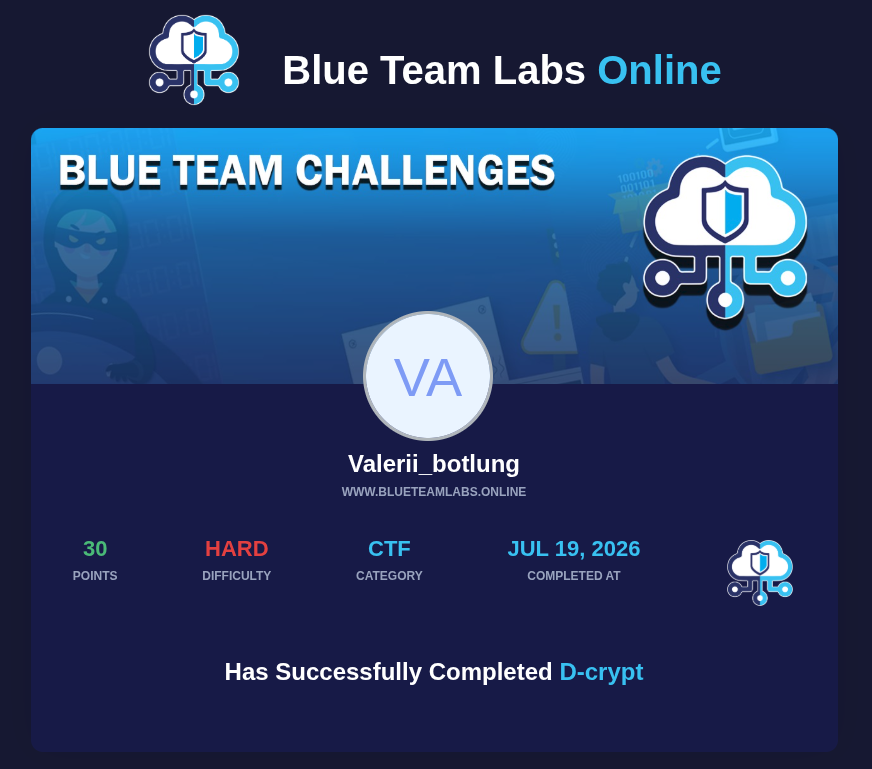

# 🕵️‍♂️ Blue Team Labs Online — D-Crypt Writeup

**Ссылка на достижение:** [BTLO Achievement](https://blueteamlabs.online/achievement/share/challenge/164988/20)

| Параметр | Значение |
| :--- | :--- |
| **Категория** | Digital Forensics / Cryptography |
| **Никнейм** | valebg |
| **Финальный флаг** | `SBT{Y0U_AR3_4_N3rd!}` |

---

## 1. 📜 Сценарий и задача
Спецслужбы перехватили заархивированный файл у подозреваемого в терроризме, который пытался отправить его сообщнику. Наша задача — провести глубокий анализ артефактов, восстановить скрытый контекст и извлечь финальное секретное сообщение.

### 🖼️ Лабораторный артефакт


---

## 2. 🔍 Ход исследования и анализ

### Шаг 1: Сбор метаданных и базовая стеганография
Первым делом запускаем сбор метаданных через `exiftool` и проверяем файл на наличие скрытых контейнеров с помощью стандартного инструмента `steghide`:
```bash
exiftool SBT.jpg
steghide extract -sf SBT.jpg

Шаг 2: Извлечение скрытых данных через Strings и Unzip
Проверяем структуру файла на наличие скрытых текстовых строк или сигнатур других файлов с помощью утилиты strings:

Bash
strings SBT.jpg
В самом конце вывода обнаруживается упоминание файла message.png. Пробуем распаковать файл напрямую через unzip:

Bash
unzip SBT.jpg
Шаг 3: Верификация типа файла
Проверяем реальный тип извлеченного файла с помощью команды file:

Bash
file message.png
🧬 3. Многослойное декодирование (Криптография)
Этап 1: URL Decode & ROT47

Декодируем URL-строку и отправляем полученный шифротекст на анализ в dCode. Применяем ROT-47.

Этап 2: Base32 Decode & Реверс строки

Декодируем полученную массу через Base32. Разворачиваем полученную строку задом наперед (Reverse).

Этап 3: Base64 Decode & Скрытый Whitespace

После реверса прогоняем строку через Base64 Decode в CyberChef. На выходе получаем визуально пустой результат, состоящий исключительно из невидимых символов — пробелов (Spaces) и табуляций (Tabs).

🎯 4. Извлечение флага (Whitespace Стеганография)
Переводим невидимый Whitespace-код в бинарный вид (пробелы — 0, табуляции — 1) и конвертируем финальные байты в текст.

Финальный результат:
SBT{Y0U_AR3_4_N3rd!}
