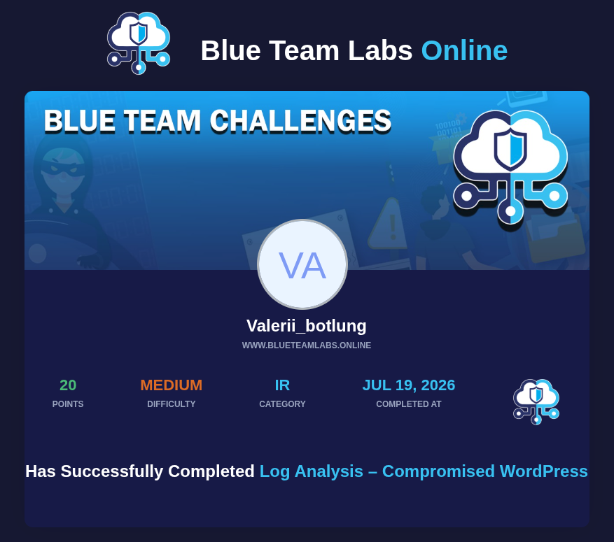

# BTLO Challenge: Compromised WordPress (Log Analysis)

*Кликните на изображение выше, чтобы перейти к подтверждению выполнения лабораторной работы.*

---

## Сводная таблица ответов

| № | Вопрос | Ответ |
|---|---|---|
| 1 | Identify the URI of the admin login panel... | `/wp-login.php?itsec-hb-token=adminlogin` |
| 2 | Can you find two tools the attacker used? | `WPScan`, `sqlmap` |
| 3 | What CVE was the plugin vulnerable to? | `CVE-2020-35489` |
| 4 | What plugin was exploited to get access? | `Simple File List` |
| 5 | What is the name of the PHP web shell file? | `fr34k.php` |
| 6 | What was the HTTP response code provided... | `404` |

---

## Ход расследования (Writeup)

1. **Поиск админки и токена:** С помощью частотного анализа уникальных URI в `access.log` была обнаружена скрытая панель авторизации `/wp-login.php?itsec-hb-token=adminlogin` (сгенерированная плагином iThemes Security).
2. **Идентификация инструментов:** Анализ логов по полю User-Agent выявил сканирование сайта с помощью популярных утилит `WPScan` и `sqlmap`.
3. **Анализ уязвимостей плагинов:** В логах зафиксированы запросы к `contact-form-7` версии 5.3.1, которая подвержена RCE-уязвимости обхода загрузки файлов (**CVE-2020-35489**).
4. **Обнаружение шелла:** Успешная загрузка вредоносного PHP-скрипта была произведена через плагин **Simple File List**. Атакующий обращался к шеллу по пути `/wp-content/uploads/simple-file-list/fr34k.php`.
5. **Финальный статус:** Последний лог обращения к шеллу вернул код ответа **404**, что свидетельствует о его удалении.
