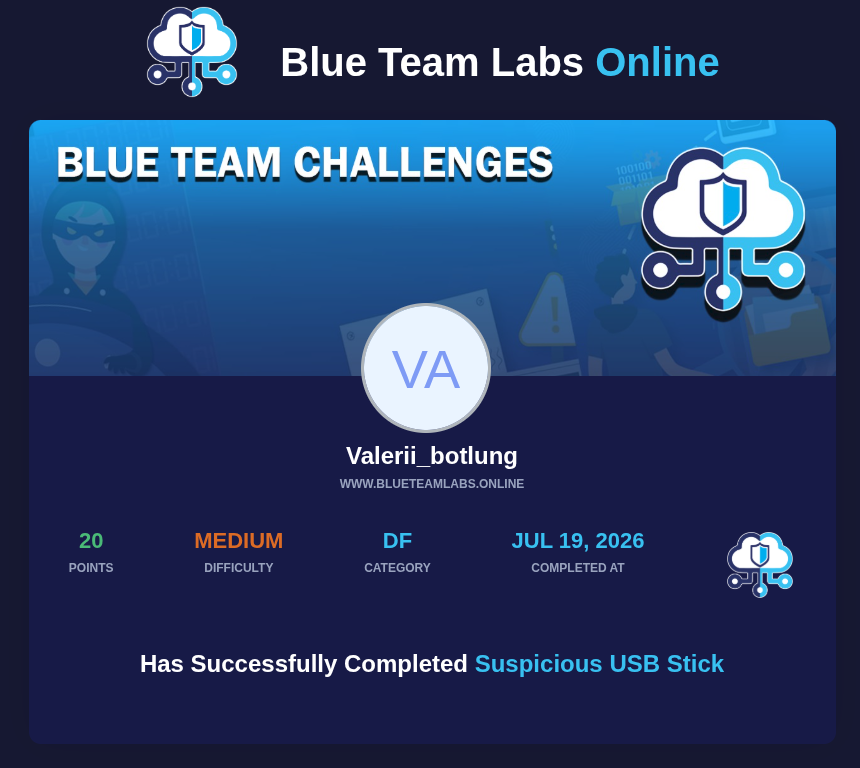

# BTLO Challenge: Suspicious USB Stick (Malware & Forensics Analysis)

*Кликните на изображение выше, чтобы перейти к подтверждению выполнения лабораторной работы.*

---

## Сводная таблица ответов

| № | Вопрос | Ответ |
|---|---|---|
| 1 | What file is the autorun.inf running? | `README.pdf` |
| 2 | Does the pdf file pass virustotal scan? | `No` |
| 3 | Does the file have the correct magic number? | `Yes` |
| 4 | What OS type can the file exploit? | `Windows` |
| 5 | A Windows executable is mentioned in the pdf file, what is it? | `cmd.exe` |
| 6 | How many suspicious /OpenAction elements does the file have? | `1` |

---

## Ход исследования (Writeup)

1. **Анализ Autorun:** Файл `autorun.inf` настроен на автоматическое открытие документа `README.pdf` при подключении к системе.
2. **Проверка сигнатуры:** Команда `hexdump` подтвердила корректный Magic Number документа: `25 50 44 46` (`%PDF-1.7`), что говорит о том, что файл не переименован принудительно из обычного исполняемого файла.
3. **Обнаружение полезной нагрузки:** С помощью утилиты `strings` внутри PDF-структуры была найдена скрытая директива запуска приложения `/S/Launch/Type/Action/Win`. Атака нацелена на операционную систему **Windows** и использует вызов командной строки **`cmd.exe`** для выполнения вредоносного сценария в фоновом режиме при открытии файла пользователем.
