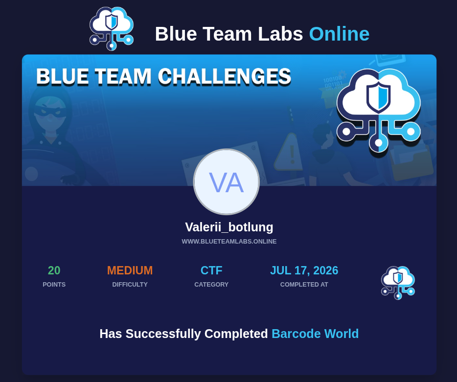

# Blue Team Labs / CTF Challenge: Barcode World

Скрипт для автоматического декодирования и сборки скрытого флага из коллекции из 9 374 изображений штрих-кодов.

## 🎯 Описание задачи
В папке `Barcode_World` находится 9,374 изображений формата `.png` с именами от `1.png` до `9374.png`. Каждый штрих-код содержит десятичный ASCII-код одного или нескольких символов. Задача — собрать их все строго по порядку, сконвертировать в читаемый текст и извлечь флаг.

## 🛠️ Окружение и зависимости
* **ОС:** Parrot OS
* **Язык:** Python 3.13+
* **Библиотеки:** `opencv-python`, `pyzbar`, `pillow`
* **Системные зависимости:** `libzbar0`

## 🚀 Решение
Для решения был написан Python-скрипт, который:
1. Итерируется по файлам строго в правильном хронологическом порядке (от 1 до 9374).
2. Использует `OpenCV` и `pyzbar` для быстрого и точного декодирования каждого кадра.
3. Собирает массив сырых данных, разбивает их и конвертирует ASCII-коды в финальное текстовое полотно.

### Исходный код (`solve.py`)
```python
import cv2
from pyzbar.pyzbar import decode
import os

folder = "./Barcode_World"
barcode_data = []

print("[*] Запуск разбора штрих-кодов...")

for i in range(1, 9375):
    image_path = os.path.join(folder, f"{i}.png")
    image = cv2.imread(image_path)
    
    if image is None:
        continue
        
    decoded = decode(image)
    for barcode in decoded:
        chunk = barcode.data.decode("utf-8")
        barcode_data.append(chunk)

raw_numbers_str = "".join(barcode_data)

print("\\n[*] Декодирование завершено! Конвертируем...")
try:
    clean_text = "".join(chr(int(num)) for num in raw_numbers_str.split() if num.isdigit())
    print("\\n[+] РЕЗУЛЬТАТ:")
    print(clean_text)
except Exception as e:
    print("[-] Ошибка конвертации:", e)
```

## 🏁 Результат и Флаг
После запуска скрипт успешно собрал текст, внутри которого находился заветный ключ:
> **This is the flag - B4rc0d3_H1570rY.**

---

### 🏆 Статус задания
[](https://blueteamlabs.online/achievement/share/challenge/164988/34)

*Нажмите на изображение выше, чтобы проверить статус выполнения на платформе Blue Team Labs Online.*
