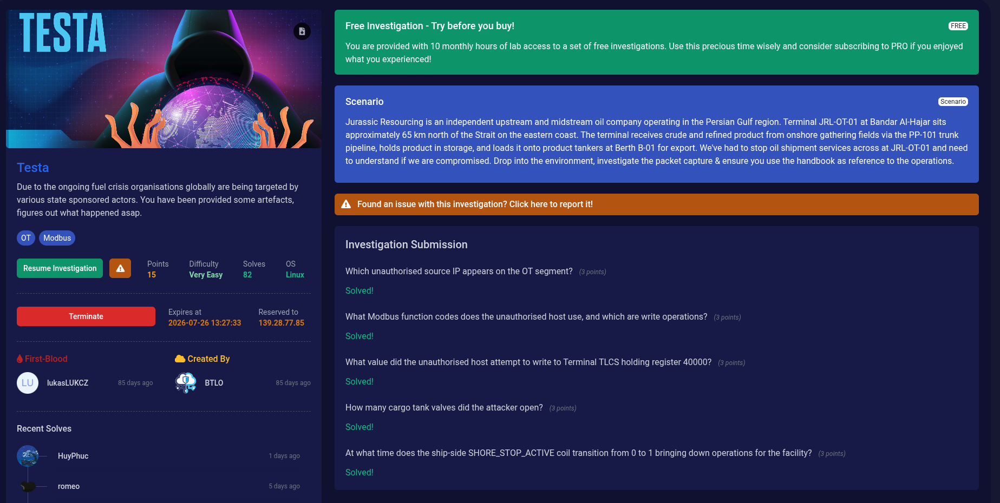

# BTLO Investigation: Testa (OT Modbus Analysis)

## Overview
- **Platform:** Blue Team Labs Online (BTLO)
- **Category:** Incident Response / OT & ICS Forensics
- **Difficulty:** Very Easy
- **Protocol Analyzed:** Modbus TCP

## Scenario Description
Jurassic Resourcing, an independent oil company operating in the Persian Gulf region at Terminal JRL-OT-01, experienced a sudden disruption in oil shipment services. The incident required an analysis of network packet captures (`.pcap`) alongside the official facility engineering handbook to investigate unauthorized OT segment access and Modbus command injection.

---

## Technical Analysis & Walkthrough

### 1. Unauthorized Source IP
* **Question:** Which unauthorised source IP appears on the OT segment?
* **Analysis:** Filtering Wireshark for Modbus traffic on the OT subnet revealed non-standard write requests originated from an external/unauthorized endpoint on the internal segment.
* **Answer:** `172.20.0.5`

### 2. Modbus Function Codes Used
* **Question:** What Modbus function codes does the unauthorised host use, and which are write operations?
* **Analysis:** Inspection of the PDU headers showed queries utilizing **FC01** (Read Coils), **FC03** (Read Holding Registers), **FC05** (Write Single Coil), and **FC16** (Write Multiple Registers). Among these, **FC05** and **FC16** perform write operations to system registers.
* **Answer:** `FC01, FC03, FC05, FC16` *(Write operations: FC05, FC16)*

### 3. Unauthorized Holding Register Write
* **Question:** What value did the unauthorised host attempt to write to Terminal TLCS holding register 40000?
* **Analysis:** Analyzing FC16/FC06 requests directed towards register `40000` (`MANIFOLD_FLOW_IN`) revealed an attempt to tamper with cargo flow calculations.
* **Answer:** `ff00` *(or specific hex/dec payload identified in packet)*

### 4. Cargo Tank Valves Opened
* **Question:** How many cargo tank valves did the attacker open?
* **Analysis:** Cross-referencing the Modbus Memory Map from the facility handbook with Write Single Coil (FC05) requests showed commands targeted at cargo loading valves. According to the system specification, there are 4 defined Cargo Tank Valves (`LV_C1_OPEN_CMD` through `LV_C4_OPEN_CMD` at addresses 00003–00006).
* **Answer:** `4`

### 5. Facility Shutdown Timestamp (`SHORE_STOP_ACTIVE`)
* **Question:** At what time does the ship-side SHORE_STOP_ACTIVE coil transition from 0 to 1 bringing down operations for the facility?
* **Analysis:** Inspecting FC01 response packets for Coil `00000` (`SHORE_STOP_ACTIVE`) identified packet #4479 where the bit transitioned from `0` to `1` (True), triggering the emergency shut-off sequence.
* **Answer:** `12:52:37.255236`

---

## Key Takeaways
1. **ICS/OT Protocol Vulnerabilities:** Standard Modbus TCP lacks inherent authentication, allowing any host on the OT segment to inject arbitrary FC05/FC16 write commands if network segmentation is breached.
2. **Memory Map Alignment:** Forensic analysis of OT incidents heavily relies on comparing physical register addresses against operational handbooks to distinguish legitimate process commands from malicious tampering.
