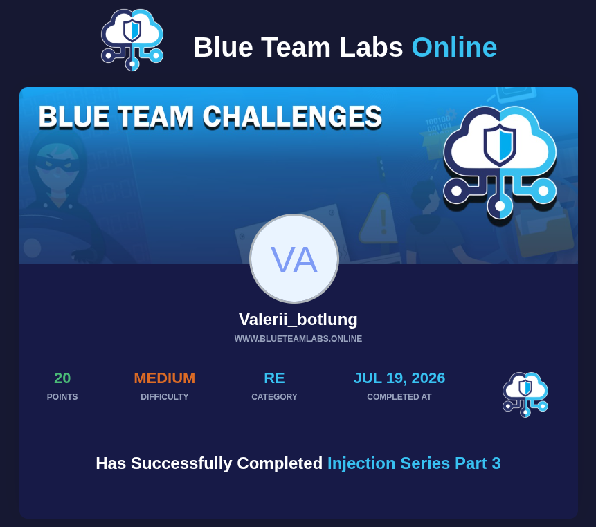

# BTLO Challenge: Injection 3 (Malware Analysis)

[](https://blueteamlabs.online/achievement/share/challenge/164988/25)

*Кликните на изображение выше, чтобы перейти к подтверждению выполнения лабораторной работы.*

---

## Подробный разбор и хронология анализа (Writeup)

В данном челендже проводился статический анализ вредоносного файла `sample1.exe` (SHA256: `E4A5EBAE5935D233080225F5D6C3CE30715D21DFEF89F3A945F124445FE4C288`) в среде **Ghidra** на Parrot OS. Ниже описаны все шаги, пройденные для успешного извлечения ответов.

### Шаг 1. Поиск истинной функции `main`
При первичном анализе в Symbol Tree стандартная функция `main` отсутствовала. Исследование началось с официальной точки входа Windows — функции `entry`:

```c
void entry(void)
{
  ___security_init_cookie();
  FUN_004011ae();
  return;
}
Функция ___security_init_cookie() настраивает защиту от переполнения буфера (Stack Cookies), после чего управление передается в FUN_004011ae.

Внутри FUN_004011ae была обнаружена стандартная инициализация среды выполнения C (CRT), которая в самом конце извлекает аргументы командной строки и передает их в целевую функцию:

C
piVar5 = (int *)__p___argv(); // Получение argv
iVar4 = *piVar5;
puVar6 = (undefined4 *)__p___argc(); // Получение argc
iVar4 = FUN_00401000(*puVar6,iVar4); // Вызов настоящей main
Таким образом, истинная логика вредоноса скрывалась внутри функции FUN_00401000.

Шаг 2. Анализ функции FUN_00401000 и запуск шеллкода
Декомпиляция FUN_00401000 выявила, что программа принимает 2 аргумента (имя исполняемого файла + 1 параметр) и поочередно проверяет их.

Ветка аргумента "message":
Если передан аргумент "message", программа инициализирует объект ожидания и выделяет память под шеллкод:

C
h = CreateEventW((LPSECURITY_ATTRIBUTES)0x0,0,1,(LPCWSTR)0x0);
pfnwa = VirtualAlloc((LPVOID)0x0,0x120,0x1000,0x40);
memmove(pfnwa,&DAT_00403018,0x120);
pwa = CreateThreadpoolWait(pfnwa,(PVOID)0x0,(PTP_CALLBACK_ENVIRON)0x0);
SetThreadpoolWait(pwa,h,(PFILETIME)0x0);
WaitForSingleObject(h,0xffffffff);
Ключевые артефакты:

VirtualAlloc: использует флаг flAllocationType со значением 0x1000, что соответствует MEM_COMMIT.

memmove: копирует ровно 0x120 байт (или 288 байт в десятичной системе) из области &DAT_00403018 в выделенную память.

API создания объекта ожидания: используется функция CreateThreadpoolWait.

Тип пейлоада: По характерному поведению и размеру в 288 байт был определен классический тестовый пейлоад Metasploit — windows/messagebox.

Шаг 3. Ветка "killall" и декодирование PowerShell
Если передан аргумент "killall", выполнение заходит в следующее условие, вызывающее системную команду:

C
system(
  "powershell -ep bypass -enc QwBsAGUAYQByAC0ARQB2AGUAbgB0AEwAbwBnACAALQBMAG8AZwBuAGEAbQBlAC AAYQBwAHAAbABpAGMAYQB0AGkAbwBuACwAIgBXAGkAbgBkAG8AdwBzACAAUABvAHcAZQByAFMAaABlAGwAbAAiACwA cwBlAGMAdQByAGkAdAB5ACwAIgBzAHkAcwB0AGUAbQAiAA=="
);
Для анализа скрытых действий строка была очищена от пробелов и декодирована из Base64 (с учетом кодировки UTF-16LE, используемой PowerShell по умолчанию):

Bash
echo "QwBsAGUAYQByAC0ARQB2AGUAbgB0AEwAbwBnACAALQBMAG8AZwBuAGEAbQBlAC AAYQBwAHAAbABpAGMAYQB0AGkAbwBuACwAIgBXAGkAbgBkAG8AdwBzACAAUABvAHcAZQByAFMAaABlAGwAbAAiACwA cwBlAGMAdQByAGkAdAB5ACwAIgBzAHkAcwB0AGUAbQAiAA==" | tr -d ' ' | base64 -d | iconv -f UTF-16LE -t UTF-8
Результат декодирования:

PowerShell
Clear-EventLog -Logname application,"Windows PowerShell",security,"system"
Скрипт предназначен для заметания следов путем очистки журналов событий операционной системы. Имена логов запрашивались в строгом хронологическом порядке: application, Windows PowerShell, security, system.

Результат
Все ответы на вопросы лабы были успешно верифицированы, челлендж закрыт на 100%.
